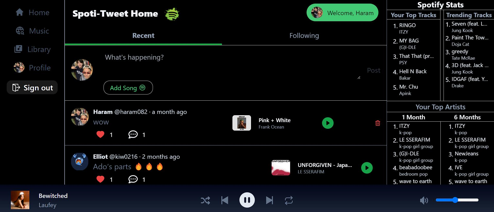
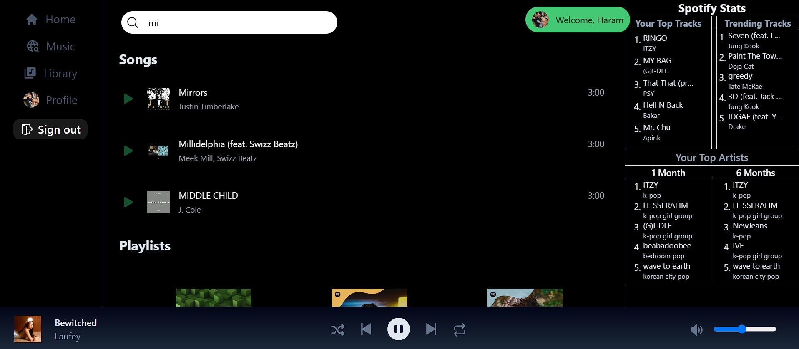
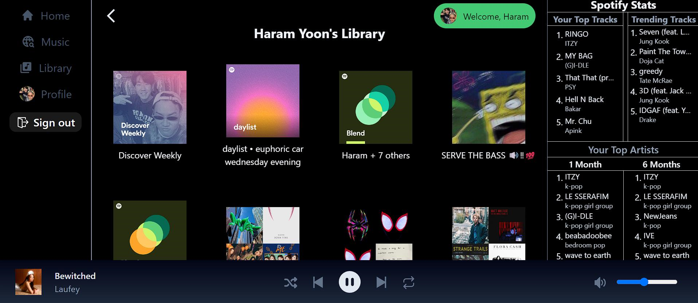
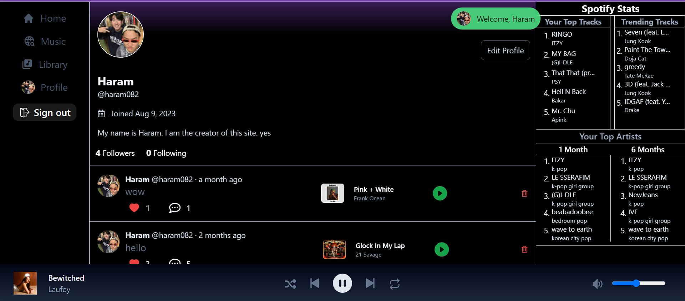

# Spotitweet

This is a [T3 Stack](https://create.t3.gg/) project bootstrapped with `create-t3-app`.

- [Next.js](https://nextjs.org)
- [NextAuth.js](https://next-auth.js.org)
- [Prisma](https://prisma.io)
- [Tailwind CSS](https://tailwindcss.com)
- [tRPC](https://trpc.io)

# Spoti-Tweet

## Welcome to Spoti-Tweet!!!

### What is this?

Spoti-tweet is a web app that combines Spotify and Twitter to create a social media platform for sharing everything music.

### How do I use the Spotify part?

First, you need to connect your Spotify account by pressing signIn. You will be able to look at your playlists and songs just like the Spotify app. You can even search up different songs, artist, and albums. There is also a player component that lets you play these songs. However, you need to have an external Spotify Web Player playing for it to work. To do this, go to Spotify with your account, and press play/pause once or twice. The volume functionality does not work on mobile versions. Additionally, when you play a song from an album or playlist, the rest of the playlist isn't added onto the queue as it hasn't been implemented yet.

### How do I use the Twitter part?

Just like every other social media platform, you can post, like, and comment on posts. You can change your name, username, and bio in the profile section. You can follow other users to see their specific posts as well. What makes this app special is that you have to attach a song to each post.

### Good luck and have fun !!! FYI: Spotify features will only work with Spotify Premium

**SPOTI-TWEET IS CURRENTLY NOT OUT FOR PUBLIC. EITHER REQUEST ACCESS BY EMAILING HARAMKIM082@GMAIL.COM OR USE THIS SAMPLE ACCOUNT. EMAIL: HARAMALT60@GMAIL.COM PASSWORD: HARAMALT60**

## Pages

Welcome to My Awesome Website! This web application offers a variety of features for social media enthusiasts and music lovers. Check out the different pages below:

### Home - Social Media Feed

The Home page displays a dynamic social media feed, where you can view posts from other users, like, comment, and even post your own updates. Stay connected with friends and discover what's happening in the world of social media.

### Music Search

The Music Search page allows you to explore a vast library of songs, albums, and artists. You can search for your favorite music, listen to song previews, and even add tracks to your playlists. Find new music to groove to!

### Personal Playlists

With the Personal Playlists page, you can manage your music collection effortlessly. Create, edit, and organize your playlists, and easily access your favorite songs whenever you want. Your music, your way.

### Profile Page

The Profile page is your personal space. Customize your profile with a unique picture, bio, and more. View your posts, followers, and those you follow. Share your musical journey with the world.

Explore these pages and make the most of your experience on My Awesome Website!

## Description

This project is a Spotify clone application with an integrated Twitter feed. It was built using Next.js and Tailwind CSS for the frontend, next-auth for authentication, and the t3 stack (tRPC, Tailwind, Prisma) for the backend.

## Features

- User authentication with next-auth
- Spotify API integration to access user playlists, top songs/artists, albums, and artist info
- Search component to search Spotify tracks, albums, and artists
- Music player to play/pause, skip tracks from Spotify
- Twitter feed integration showing tweets and profiles
- tRPC API with Prisma ORM for CRUD operations on MySQL database
- Typesafe database schema for posts, users, comments, likes
- Next.js API routes to interface with tRPC API
- Revalidation and caching for fresh data

